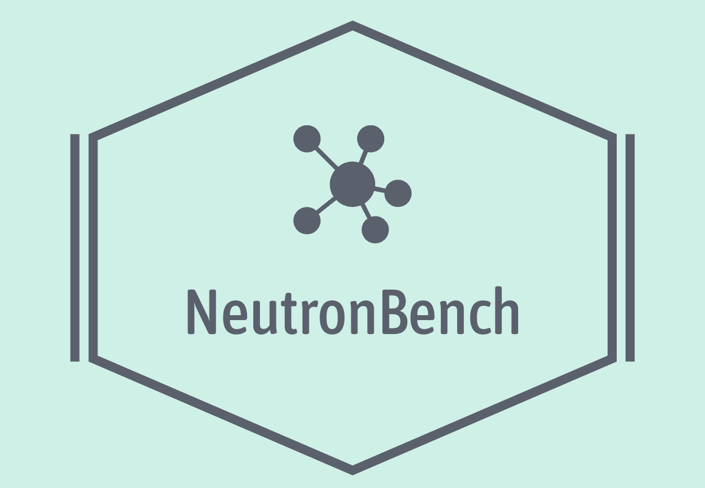

<div align=center></div>

<p align="center">
    A GNN system evaluation framework.
</p>


**[NeutronBench](https://github.com/iDC-NEU/NeutronBench)** is a `GNN system evaluation framework` built on [NeutronStar](https://github.com/iDC-NEU/NeutronStarLite). 


## Quick Start

### Dependencies

- **cmake** (>=3.14.2).
- **mpich** (>=3.3.3) for inter-process communication.
- **libnuma** for NUMA-aware memory allocation.
- **cub** for GPU-based graph propagation.
- **libtorch** version > 1.7 with gpu support for nn computation.


### Building 

First clone the repository and initialize the submodule:

```bash
git clone https://github.com/iDC-NEU/NeutronBench.git
cd NeutronBench
git submodule update --init --recursive

# or just use one command
git clone --recurse-submodules https://github.com/iDC-NEU/NeutronBench.git
```


To build:

```shell
mkdir build && cd build
cmake ..
make -j4
```


To run:

List all nodes in `./NeutronBench/hostfile` for MPI communication:
```bash
ip1
ip2
ip3
```
copy NeutronBench directory to all your machines (copy_all.sh and make_and_copy.sh) and run the following command in your root DIR.


### Datasets

All datasets we used:

| Datasets  | Nodes   | Edges   | #F   | #L   | #hidden |
| --------- | ------- | ------- | ---- | ---- | ------- |
| Reddit  | 232.96K | 114.85M | 602 | 41 | 128  |
| OGB-Arxiv  | 169.34K | 2.48M | 128 | 40 | 128  |
| OGB-Products  | 2.45M | 126.17M | 100 | 47 | 128  |
| OGB-Papers  | 111.06M | 1.6B | 128 | 173 | 128 |
| Amazon  | 1.57M | 264,34M | 200 | 107 | 128  |
| LiveJournal  | 4.85M | 90.55M | 600 | 60 | 128 |
| Lj-large  | 7.49M | 232.1M | 600 | 60 | 128 |
| Lj-links  | 5.2M | 205.25M | 600 | 60 |128 |
| Enwiki-links  | 13.59M | 1.37B | 600 | 60 | 128 |


we provide a python script to generate the data files:

```bash
python ./data/generate_nts_dataset.py --dataset ogbn-papers100M --self-loop False
```


### Experiments

> Data partitioning experiments

```bash
# partitioning
python ./exp/exp-partition/exp-partition.py
```


> Batch preparation experiments

```bash
# batch size
python .exp/exp-batch-size/exp-batch-size.py

# sample rate
python ./exp/exp-sample-rate/sample-rate.py
```


> Data Transferring experiments

```bash
# different optimization
python .exp/exp-diff-optim/exp-diff-optim.py

# hybrid transfer
python .exp/exp-hybrid-trans/exp-hybrid-trans.py

# pipeline
python .exp/exp-diff-optim/exp-diff-pipe.py

# gpu cache 
python .exp/exp-gpu-cache/exp-gpu-cache.py
```

